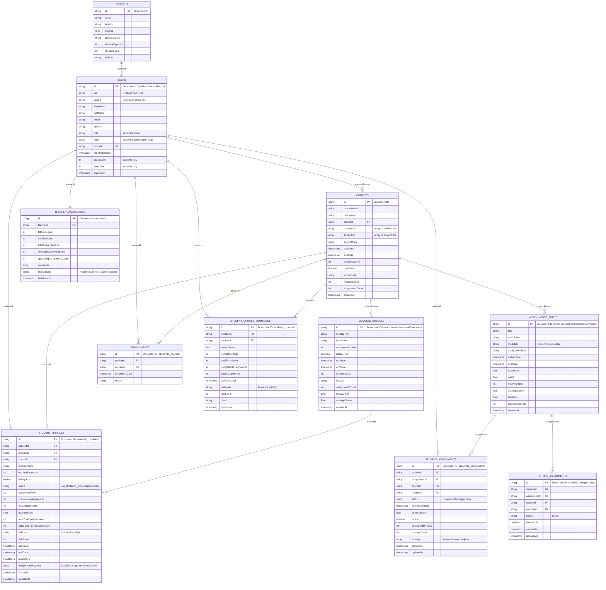

Based on the Firebase import script, here's the database schema visualization with clear distinction between **Collections** and **Subcollections**:



## **Collections vs Subcollections**

### **ROOT COLLECTIONS** (Top-level Firestore collections):
These are accessed directly at the database root level:

1. **`schools`** - Educational institutions
2. **`users`** - Students and teachers (unified user system)
3. **`courses`** - Academic courses (parent collection)
4. **`enrollments`** - Student-course relationships
5. **`studentAssignments`** - Completed assignment submissions
6. **`futureAssignments`** - Assignments not yet available
7. **`studentModules`** - Module-level progress tracking
8. **`studentCourseSummaries`** - Course-level performance summaries
9. **`teacherDashboards`** - Teacher analytics and insights

### **SUBCOLLECTIONS** (Nested under parent collections):
These are nested within parent documents and accessed via parent path:

**Under `courses/{courseId}/`:**
1. **`modules`** - Course modules (nested under each course)
   - Path: `courses/{courseId}/modules/{moduleId}`
   
2. **`assignments`** - Course assignments (nested under each course)
   - Path: `courses/{courseId}/assignments/{assignmentId}`

## **Database Structure Hierarchy:**

```
📁 Firestore Database Root
├── 📂 schools/                    (Collection)
├── 📂 users/                      (Collection)
├── 📂 courses/                    (Collection)
│   └── 📄 {courseId}/             (Document)
│       ├── 📂 modules/            (Subcollection)
│       │   └── 📄 {moduleId}      (Document)
│       └── 📂 assignments/        (Subcollection)
│           └── 📄 {assignmentId}  (Document)
├── 📂 enrollments/                (Collection)
├── 📂 studentAssignments/         (Collection)
├── 📂 futureAssignments/          (Collection)
├── 📂 studentModules/             (Collection)
├── 📂 studentCourseSummaries/     (Collection)
└── 📂 teacherDashboards/          (Collection)
```

## **Key Points:**

- **Collections** exist at the root level and can be queried independently
- **Subcollections** are nested within documents and inherit the parent document's path
- Subcollections allow for better data organization and hierarchical queries
- In this schema, `modules` and `assignments` are subcollections under `courses` because they belong specifically to individual courses
- All other data types are root collections because they need to be queried across the entire system (e.g., finding all assignments for a student across multiple courses)

This design provides both hierarchical organization (subcollections) and efficient cross-collection querying (root collections) for the learning management system.